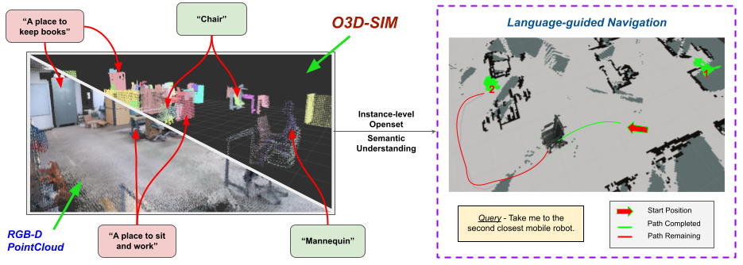

# Open-Set 3D Semantic Instance Maps for Vision Language Navigation -- O3D-SIM

Laksh Nanwani1, &nbsp;&nbsp;&nbsp; Kumaraditya Gupta1*,&nbsp;&nbsp;&nbsp;Aditya Mathur1*,&nbsp;&nbsp;&nbsp;Swayam Agrawal1,
 
A.H. Abdul Hafez2,&nbsp;&nbsp;&nbsp;K. Madhava Krishna1

1Robotics Research Center, IIIT Hyderabad, India&nbsp;&nbsp;&nbsp;&nbsp;2Hasan Kalyoncu University, Turkey 
*equal contribution

<h2 class="title is-3">BibTeX</h2>
          <pre><code>
@article{doi:10.1080/01691864.2024.2395926,
author = {Nanwani,Laksh and Gupta,Kumaraditya and Mathur,Aditya and Agrawal,Swayam and Abdul Hafez,A.H. and Krishna,K. Madhava},
title = {Open-Set 3D Semantic Instance Maps for Vision Language Navigation - O3D-SIM},
journal = {Advanced Robotics},
year = {2024},
doi = {10.1080/01691864.2024.2395926},

}</code></pre>
    

  

# Website License
 This work is licensed under a <a rel="license" href="http://creativecommons.org/licenses/by-sa/4.0/">Creative Commons Attribution-ShareAlike 4.0 International License</a>.
